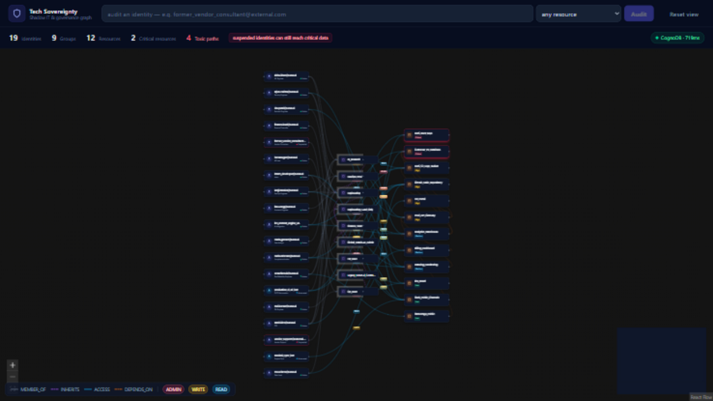
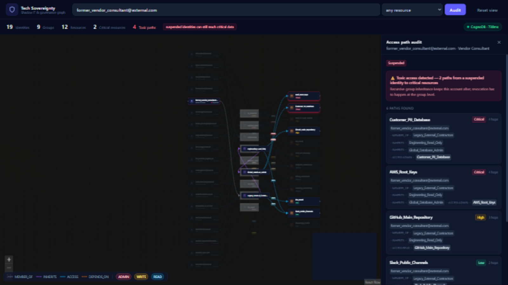
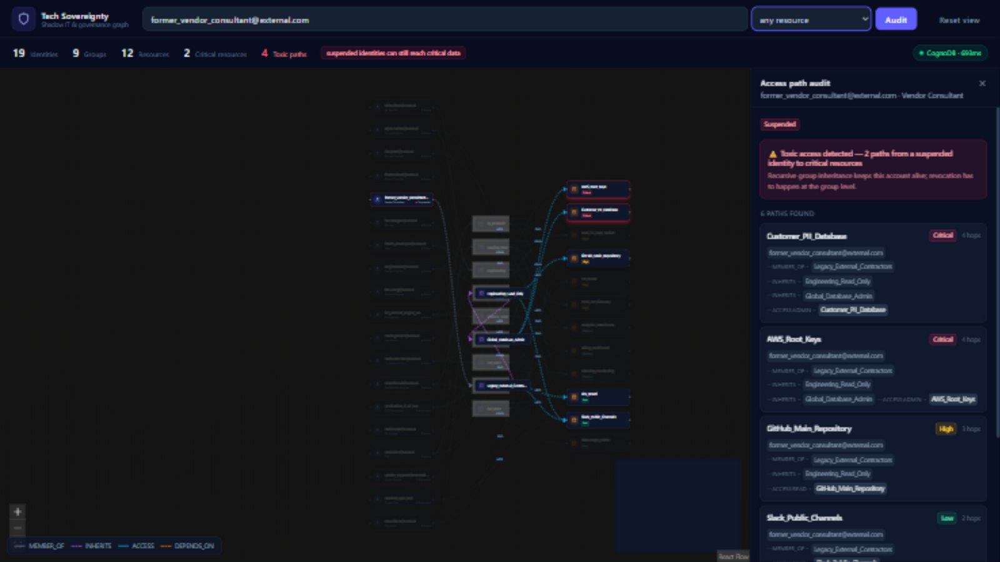
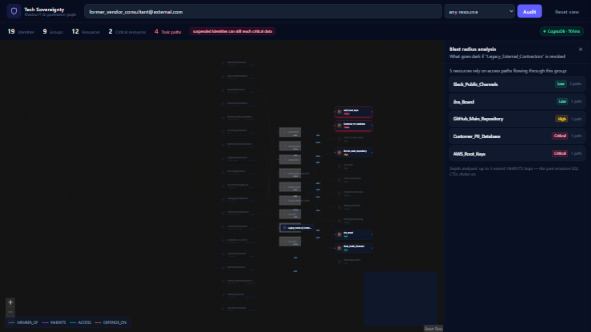
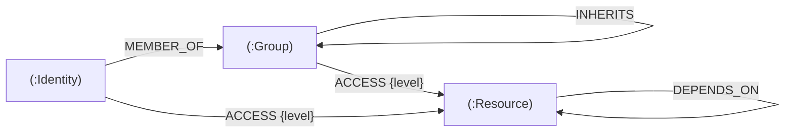
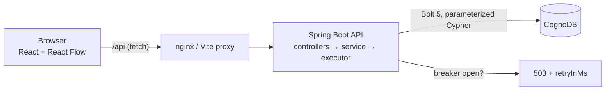
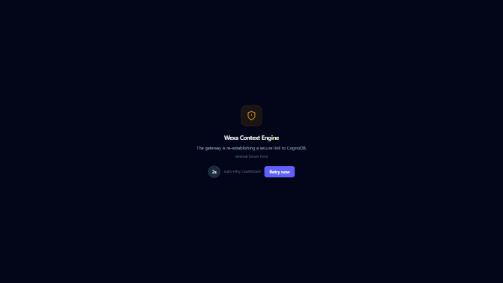

# Tech Sovereignty Graph

**Shadow IT & Governance Tracker** — an enterprise graph application that maps *who* can reach *what*, through *which* groups, and exposes the paths nobody remembers approving.

> **Live demo:** [techsovereigntyclient.netlify.app](https://techsovereigntyclient.netlify.app) · API health: [tech-sovereignty-api.onrender.com/api/health](https://tech-sovereignty-api.onrender.com/api/health)
> (Deploy your own in minutes: see [Running with Docker](#running-with-docker))

---

## The problem, in one story

Eight months ago an external consultant finished a project at Wexa. HR suspended his account on his last day — checklist ticked, job done.

Except access control is not a checkbox. It's a *graph*. While he was onboarded, he was added to `Legacy_External_Contractors`. That group quietly inherits from `Engineering_Read_Only`. And at some point in the past, someone — for reasons nobody remembers — gave `Engineering_Read_Only` an inheritance link to `Global_Database_Admin`, which holds **ADMIN** on `Customer_PII_Database`.

So today, a suspended account still holds a live admin path to customer PII:

```
former_vendor_consultant@external.com
  → MEMBER_OF   Legacy_External_Contractors
  → INHERITS    Engineering_Read_Only
  → INHERITS    Global_Database_Admin
  → ACCESS[ADMIN]   Customer_PII_Database        ⚠ toxic
```

No single system shows this. The HR tool says *suspended*. The cloud IAM says *he's not in any active group*. The database knows nothing about either. The risk lives **between** systems — in the shape of the graph.

This app makes that shape visible and searchable: open the page and the header already warns **"4 toxic paths"**; audit the consultant and the full chain lights up on screen in one click.

## Why a graph database?

Effective permissions are recursive: *every group you're in, plus every group those groups inherit from, to any depth, plus everything they can touch.*

In SQL that's the recursive-CTE problem — stacked set operations that get slower and hairier with every nesting level the org adds. In Cypher, the question *is* the path:

```cypher
MATCH path = (u:Identity {email: $email})-[:MEMBER_OF|INHERITS*1..5]->(g)-[:ACCESS]->(r:Resource)
RETURN path
```

Index-free adjacency makes each hop a pointer chase, not a join — variable-depth questions are expressed naturally, not hammered into schema workarounds. The blast-radius query is the same story told in reverse: *revoke this group, and which resources go dark, through how many inheritance chains?* As relational SQL that's a recursive CTE joined into an aggregation; as Cypher it's four readable lines.

## What you can do with the app

1. **See the whole estate** — identities → groups → resources on one canvas, color-coded by sensitivity (red = Critical) and account status (red ring = suspended).
2. **Audit any identity** — type an email, and every access path it has lights up: hops, access levels (`READ`/`WRITE`/`ADMIN`), and a toxicity flag when a suspended account reaches critical data.
3. **Simulate compromise** — pick an identity and watch everything it could touch pulse red: the blast radius of stolen credentials.
4. **Run a revocation preview** — pick a group and see exactly which resources would go dark and how many inheritance paths each loses.
5. **Inspect any node** — click it for properties plus live upstream/downstream dependencies.

| Overview | Toxic audit |
|---|---|
|  |  |
| **Compromise simulation** | **Revocation preview** |
|  |  |

## Data model

```
(:Identity {id, email, role, status})        status: Active | Suspended | Automated
(:Group {id, name})
(:Resource {id, name, sensitivity})          sensitivity: Critical | High | Medium | Low

(:Identity)-[:MEMBER_OF]->(:Group)
(:Group)-[:INHERITS]->(:Group)               // the recursive link — where trouble hides
(:Identity|Group)-[:ACCESS {level}]->(:Resource)
(:Resource)-[:DEPENDS_ON]->(:Resource)
```



The seed dataset (40 nodes, 71 relationships) models a believable mid-size company: 19 identities including engineers, an intern, two CI/LLM service agents, two suspended external vendors; 9 groups with a six-edge inheritance tree; 12 resources from `Customer_PII_Database` down to `StatusPage_Public`. It also plants quieter findings you'd expect a real audit to surface — a CI bot with direct ADMIN on `AWS_Root_Keys`, an LLM context engine reading PII — plus a `DEPENDS_ON` web between resources.

## The main queries

Every query lives as a named constant in [`Cypher.java`](backend/src/main/java/com/wexa/sovereignty/core/Cypher.java). All are parameterized — user input only ever enters through `$params`, never string concatenation.

**Query A — access path audit** (`GET /api/audit/{email}?resource=…`), the multi-hop traversal:

```cypher
MATCH path = (u:Identity {email: $email})-[:MEMBER_OF|INHERITS*1..5]->(g)-[:ACCESS]->(r:Resource)
WHERE $resource IS NULL OR r.name = $resource
RETURN path, …
ORDER BY <severity rank>, length(path)
```

Returns every path as an ordered step list (relationship type + node, with the access level), flagged **toxic** when a `Suspended` identity reaches a `Critical` resource.

**Query B — blast radius** (`GET /api/impact/{group}`), the one relational databases find awkward:

```cypher
MATCH (target:Group {name: $groupName})
MATCH (target)-[:INHERITS*0..3]->(downstream)-[:ACCESS]->(r:Resource)
RETURN r.name, r.sensitivity, count(DISTINCT downstream) AS pathsAtRisk
```

Supporting queries cover the canvas snapshot (capped at 2000 nodes / 5000 edges — a browser can't draw unbounded graphs anyway), one-hop node context for the drawer, header stats including the toxic-path count, and a liveness probe.

## Running with Docker

The whole stack in one command — UI, API, and nginx proxying `/api` same-origin:

```bash
cp .env.example .env      # add your CognoDB credentials
docker compose up --build
```

Then open **http://localhost:5173**. API is at `http://localhost:8080` (Swagger docs at `/swagger-ui.html`).

## Running locally

**1. Create a CognoDB instance** — sign up at [console.cognodb.com](https://console.cognodb.com), create a free `c0` instance, and copy the `bolt+s://` URI and the one-time password.

**2. Backend** (Java 17+, no Maven install needed — the wrapper is committed):

```bash
cd backend
cp .env.example .env                                      # fill in the credentials
./mvnw spring-boot:run -Dspring-boot.run.profiles=seed    # indexes + demo data (idempotent)
./mvnw spring-boot:run                                    # API on :8080
```

**3. Frontend** (Node 18+):

```bash
cd frontend
npm install
npm run dev          # http://localhost:5173, proxies /api to :8080
```

## Architecture



Four thin layers, each with one job:

| Layer | Files | Responsibility |
|---|---|---|
| `web/` | 6 controllers + advice | HTTP in, DTOs out — nothing else |
| `service/` | `GraphService` | orchestration + mapping driver records → records |
| `core/` | `Cypher`, `GraphExecutor`, `CircuitBreaker` | query constants, execution, failure policy |
| `seed/` | `GraphSeeder`, `SeedRunner` | dataset + CLI entry (seeder is reused by tests) |

The frontend mirrors it: `api/` (fetch client), `hooks/` (data + health polling), `utils/` (layout, highlighting), `components/` (canvas, custom nodes, panels, states).

## Testing

**Backend — 13 tests**, `./mvnw test`:

- `CircuitBreakerTest` — threshold, cooldown, probe-reopen semantics (pure unit).
- `GraphServiceTest` — path mapping and toxicity logic against mocked driver records.
- `AuditControllerTest` — `@WebMvcTest` slice: payload shape, validation `400`s, `503`+`retryInMs` outage mapping.
- `Neo4jGraphQueriesTest` — Testcontainers: a throwaway Neo4j 5.26, the real seeder, the real Cypher. No mocks on the data path. Auto-skips when Docker isn't reachable; on Docker Desktop 29+ run it as `./mvnw test -Dtest=Neo4jGraphQueriesTest -Dapi.version=1.44 -DforkCount=0`.

**Frontend — 14 tests**, `npm test` (Vitest + Testing Library):

- `highlight.test.js` — path→highlight sets, edge-id convention shared with the canvas.
- `layout.test.js` — tier placement, critical-first ordering, unknown-type safety.
- `client.test.js` — success parsing, `retryInMs` propagation, dead-backend handling.
- `StatsBar.test.jsx`, `AuditPanel.test.jsx` — the risk header alarm and the toxic/all-clear panel states.

## Resilience & hardening

- CognoDB free instances sleep and drop connections — treated as normal: 10s connect/acquisition timeouts, a hand-rolled circuit breaker (3 failures → open 15s → single probe), clean `503` JSON with `retryInMs`, and a branded outage screen whose countdown mirrors the breaker before auto-recovering.
- Input validation on every path/query param (`@NotBlank`/`@Size`/`@Pattern`) with clean `400`s. The pattern accepts emails *and* agent slugs like `production_ci_cd_bot` — a plain `@Email` would reject real identities.
- 30s Caffeine cache on `/api/graph` and `/api/stats`; audits stay live.
- Containers run as non-root (backend), nginx serves the UI with a same-origin `/api` proxy so no CORS is needed in the containerized setup.
- `/actuator/health` + `/metrics` for ops tooling; Spring's stock Neo4j indicator is disabled because CognoDB doesn't ship the `dbms.components` procedure — `/api/health` is the real probe.



## Deployment

- **Backend → Render**: apply the blueprint in [`render.yaml`](render.yaml) (Docker runtime, builds `backend/Dockerfile`) — set the `COGNODB_*` env vars and point `CORS_ORIGINS` at the frontend origin.
- **Frontend → Netlify**: import the repo — [`netlify.toml`](netlify.toml) already sets base/build/publish; add `VITE_API_BASE_URL` = the Render API URL **before the first deploy** (Vite bakes it in at build time), then update the live-demo link at the top of this file.

## Project structure

```
backend/
  src/main/java/com/wexa/sovereignty/
    core/      Cypher constants, query executor, circuit breaker
    service/   orchestration + record mapping
    web/       thin controllers + global error handler
    model/     response records
    seed/      scenario dataset (GraphSeeder) + CLI runner (seed profile)
    config/    driver + CORS
  src/test/java/            unit, slice, and Testcontainers suites
frontend/
  src/
    api/         fetch client + endpoint functions
    components/  canvas, custom nodes, panels, states
    hooks/       data + health polling
    utils/       tiered layout, path highlighting
  src/*.test.*   Vitest + Testing Library suites
docker-compose.yml            one-command full stack
render.yaml                   Render blueprint for the API
```
