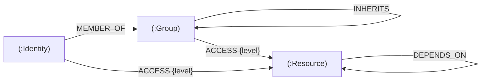

# Tech Sovereignty Graph

**Shadow IT & Governance Tracker** — an enterprise graph application that maps identities, groups and resources to expose *toxic access*: recursive permission inheritance that keeps suspended accounts connected to critical systems.

Built for the Wexa AI take-home assignment. Java 17 + Spring Boot on the backend, React + React Flow on the frontend, CognoDB as the graph layer.


## The scenario

Somewhere along the line, someone wired up this inheritance chain:

```
Legacy_External_Contractors → INHERITS → Engineering_Read_Only → INHERITS → Global_Database_Admin
```

`Global_Database_Admin` holds `ADMIN` access to `Customer_PII_Database` and `AWS_Root_Keys`. Every contractor ever added to the legacy group — including ones that were **suspended months ago** — still has a live admin path to the customer PII database. No audit tool that only checks *direct* grants will ever catch it; the path only exists two hops deep.

The app surfaces this the moment it loads: the header shows **4 toxic paths** (2 suspended identities × 2 critical resources), and one audit of `former_vendor_consultant@external.com` reveals the full chain.


## Why a graph database?

Access control is *recursive*. An employee's effective permissions are:

> every group they're a member of, plus every group those groups inherit from, plus every group *those* groups inherit from… to an unbounded depth, then every resource any of them can touch.

In SQL this is the canonical recursive-CTE problem. It works, but the query for "show me every path this person has to this database" becomes a stacked set operation that is painful to write, painful to read, and gets slower with every level of nesting the org chart grows.

Cypher states the same question as the path itself:

```cypher
MATCH path = (u:Identity {email: $email})-[:MEMBER_OF|INHERITS*1..5]->(g)-[:ACCESS]->(r:Resource)
RETURN path
```

Index-free adjacency means each hop is a pointer chase, not a join — depth costs traversals, not table scans. Variable-depth questions (`*1..5`) are the query, not a schema compromise.

The second query makes the point from the other side: *"if we revoke this group, what goes dark?"* — a reverse traversal of the same recursive structure, aggregated per resource. As a relational query it's a recursive CTE joined against an aggregation; as Cypher it's four lines.

## Data model

```
(:Identity {id, email, role, status})
(:Group {id, name})
(:Resource {id, name, sensitivity})   // Critical | High | Medium | Low

(:Identity)-[:MEMBER_OF]->(:Group)
(:Group)-[:INHERITS]->(:Group)          // the recursive link
(:Identity|Group)-[:ACCESS {level}]->(:Resource)
(:Resource)-[:DEPENDS_ON]->(:Resource)
```



Seeded with 40 nodes / 71 relationships: 19 identities (engineers, bots, a suspended vendor consultant, an LLM context engine), 9 groups, 12 resources. Bots get their own treatment — `production_ci_cd_bot` holds direct `ADMIN` on `AWS_Root_Keys`, and `llm_context_engine_v4` reads the PII database directly. Both are the kind of machine-identity sprawl the tool is meant to catch.

## The main queries

All queries live as named constants in [`Cypher.java`](backend/src/main/java/com/wexa/sovereignty/core/Cypher.java). Every one is parameterized — user input only ever enters through `$params`, never string concatenation.

**Query A — Access path audit** (`GET /api/audit/{email}?resource=…`) — multi-hop traversal:

```cypher
MATCH path = (u:Identity {email: $email})-[:MEMBER_OF|INHERITS*1..5]->(g)-[:ACCESS]->(r:Resource)
WHERE $resource IS NULL OR r.name = $resource
RETURN path, …
ORDER BY <severity>, length(path)
```

Returns each path as an ordered step list (rel type + node), flagged **toxic** when a `Suspended` identity reaches a `Critical` resource.

**Query B — Blast radius** (`GET /api/impact/{group}`) — the relational-awkward one:

```cypher
MATCH (target:Group {name: $groupName})
MATCH (target)-[:INHERITS*0..3]->(downstream)-[:ACCESS]->(r:Resource)
RETURN r.name, r.sensitivity, count(DISTINCT downstream) AS pathsAtRisk
```


Supporting queries: full graph snapshot for the canvas, one-hop node context (the drawer), stats (counts + toxic-path total), and a liveness probe.

## Running it

**1. CognoDB instance** — sign up at [console.cognodb.com](https://console.cognodb.com), create a free `c0` instance, and copy the connection URI and the one-time password.

**2. Backend** (Java 17+, no Maven install needed — the wrapper is committed):

```bash
cd backend
cp .env.example .env          # fill in COGNODB_URI / COGNODB_USER / COGNODB_PASSWORD
./mvnw spring-boot:run -Dspring-boot.run.profiles=seed   # creates indexes + loads the scenario
./mvnw spring-boot:run                                   # serves the API on :8080
```

The seeder is idempotent (`MERGE`-based), so re-running it refreshes rather than duplicates. It creates uniqueness constraints on `Identity.email`, `Group.name`, `Resource.name` and a range index on `Resource.sensitivity` *before* loading data — on a 256 MB c0 instance, lookups should hit indexes, not scans.

**3. Frontend** (Node 18+):

```bash
cd frontend
npm install
npm run dev        # http://localhost:5173, proxies /api to :8080
```

## What the UI does

- **Governance canvas** — identities → groups → resources in three tiers; nodes color-coded by sensitivity (red = Critical) and account status (red ring = suspended).
- **Access path audit** — search any identity (optionally scoped to one resource); every path lights up on the canvas with an animated chain and a panel listing hops, access levels and toxicity.
- **Simulate compromise** — picks an identity and marks every resource it could actually touch, showing the blast radius of credential theft.
- **Blast radius** — pick a group, see what goes dark if it's revoked.
- **Node drawer** — click anything for properties plus live upstream/downstream dependencies.


## Testing

```bash
cd backend
./mvnw test
```

Four suites, 13 tests:

- **`CircuitBreakerTest`** — pure unit tests: threshold, cooldown, probe-reopen semantics.
- **`GraphServiceTest`** — Mockito unit tests of the path-mapping and toxicity logic (mocked driver records, no database).
- **`AuditControllerTest`** — `@WebMvcTest` slice covering the HTTP layer: payload shape, input validation `400`s, and the `503`+`retryInMs` outage mapping.
- **`Neo4jGraphQueriesTest`** — Testcontainers integration test: boots a throwaway Neo4j 5.26, runs the real seeder, then fires the real Cypher at it. No mocks on the data path.

The container suite **self-skips automatically when no Docker daemon is reachable**, so `mvn test` stays green on machines and CI runners without Docker. One quirk worth knowing: Docker Desktop 29+ rejects older client API versions, so if your Docker needs a hint run the container suite as:

```bash
./mvnw test -Dtest=Neo4jGraphQueriesTest -Dapi.version=1.44 -DforkCount=0
```

## Operations & hardening

- **Input validation** — path/query params are `@NotBlank`/`@Size`/`@Pattern` constrained; malformed input gets a clean `400`. The pattern deliberately accepts both emails *and* agent slugs like `production_ci_cd_bot` (a plain `@Email` would reject real identities in this domain).
- **Response caching** — `/api/graph` and `/api/stats` are cached for 30s (Caffeine). Repeated canvas loads stop hitting the database; audit/impact stay uncached so interactive results are always live. Re-seeding takes up to 30s to appear.
- **Snapshot bound** — the canvas snapshot queries carry a `LIMIT 2000`: a browser can't draw unbounded graphs, and the c0 free tier shouldn't shoulder the attempt.
- **Actuator** — `/actuator/health` and `/actuator/metrics` are exposed next to the UI's own `/api/health` for ops tooling.
- **OpenAPI** — interactive API docs auto-generated at `/swagger-ui.html` (springdoc).

## Resilience

CognoDB free instances sleep and drop connections; the app treats that as a normal Tuesday:

- the driver is built with 10s connect/acquisition timeouts, so a dead database fails fast instead of hanging requests;
- a hand-rolled circuit breaker (3 consecutive failures → open for 15s → single probe) fail-fasts while the database is down;
- `ServiceUnavailable` becomes a clean `503` JSON with a `retryInMs` window — never a stack trace;
- the frontend renders a branded outage screen whose countdown mirrors the breaker, then auto-recovers when the database does.


## Deployment

The backend deploys to [Render](https://render.com) as a Java web service (`./mvnw clean package -DskipTests`, start command `java -jar target/sovereignty-1.0.0.jar` — see `render.yaml`); the frontend is a static Vite build on Vercel/Netlify with `VITE_API_BASE_URL` pointed at the API. Secrets live in the platform's environment variables — nothing sensitive is committed.

## Project structure

```
backend/
  src/main/java/com/wexa/sovereignty/
    core/      Cypher constants, query executor, circuit breaker
    service/   orchestration + record mapping
    web/       thin controllers + global error handler
    model/     response records
    seed/      scenario dataset (GraphSeeder) + CLI runner (seed profile)
    config/    driver + CORS
  src/test/java/
    core/      circuit breaker unit tests
    service/   mapping logic unit tests
    web/       controller slice tests
    seed/      Testcontainers integration tests (real Neo4j)
frontend/
  src/
    api/       fetch client + endpoint functions
    components/  canvas, custom nodes, panels, states
    hooks/     data + health polling
    utils/     tiered layout, path highlighting
```
